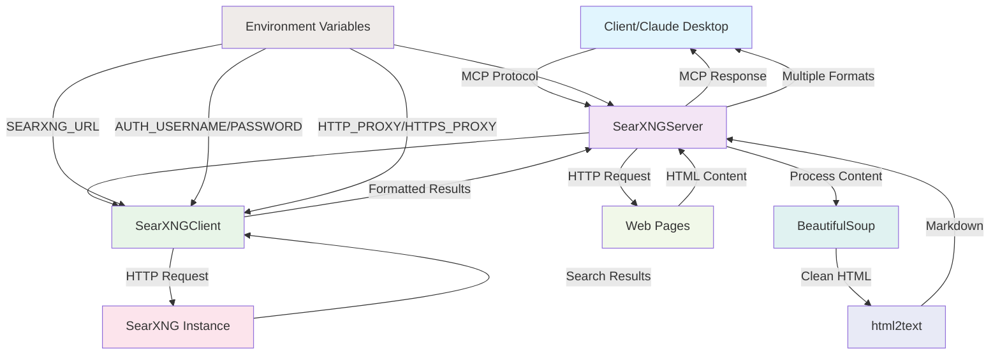

# SearXNG Search MCP Server

A robust Python implementation of the SearXNG MCP (Model Context Protocol) server that enables LLM web search capabilities. This server provides two main tools:

- `metasearch_web`: Search the web using any SearXNG instance
- `fetch_web_content`: Fetch and convert web page content to markdown

**Repository**: https://github.com/cgycorey/searxng_search_mcp

## Features

- 🔍 **Web Search**: Search using any SearXNG instance with pagination, time filtering, language selection, and safe search
- 🌐 **URL Fetching**: Fetch and convert web pages to clean markdown, HTML, text, or JSON
- 🔐 **Authentication**: Support for basic auth protected SearXNG instances
- 🛡️ **Proxy Support**: HTTP/HTTPS proxy support for restricted networks
- 📦 **uvx Compatible**: Run without installation using uvx
- 🏗️ **Production Ready**: Proper Python package with working console scripts
- 🎯 **Multiple Output Formats**: Support for markdown, HTML, plain text, JSON, and raw HTML
- 🧹 **Smart Content Processing**: Automatic script/style removal with BeautifulSoup
- ⚡ **Performance Optimized**: Efficient handling of network requests and timeouts

## Architecture



## Installation

### Using uvx (recommended)

```bash
# For development (run from source)
env SEARXNG_URL=https://searx.example.com uvx run searxng-search-mcp

# For production (build and run wheel)
uv build
env SEARXNG_URL=https://searx.example.com uvx --from ./dist/searxng_search_mcp-0.1.0-py3-none-any.whl searxng-search-mcp

# Or install as a tool first
uv tool install ./dist/searxng_search_mcp-0.1.0-py3-none-any.whl
env SEARXNG_URL=https://searx.example.com searxng-search-mcp
```

### Install as package

```bash
# Install from source
uv pip install -e .

# Or build and install
uv build
uv pip install dist/searxng_search_mcp-0.1.0-py3-none-any.whl
```

## Usage

### Environment Variables

- `SEARXNG_URL`: SearXNG instance URL (required)
- `AUTH_USERNAME`: Basic auth username (optional)
- `AUTH_PASSWORD`: Basic auth password (optional)
- `HTTP_PROXY`: HTTP proxy URL (optional)
- `HTTPS_PROXY`: HTTPS proxy URL (optional)

### Basic Usage

```bash
# Set up environment
export SEARXNG_URL=https://searx.example.com

# Development: run from source with uvx
env SEARXNG_URL=https://searx.example.com uvx run searxng-search-mcp

# Production: run from built wheel
env SEARXNG_URL=https://searx.example.com uvx --from ./dist/searxng_search_mcp-0.1.0-py3-none-any.whl searxng-search-mcp

# Or using the installed tool
env SEARXNG_URL=https://searx.example.com searxng-search-mcp

# Or using the module directly
SEARXNG_URL=https://searx.example.com uv run python -m searxng_search_mcp
```

### With Authentication

```bash
SEARXNG_URL=https://searx.example.com \
AUTH_USERNAME=your_username \
AUTH_PASSWORD=your_password \
uvx --from ./dist/searxng_search_mcp-0.1.0-py3-none-any.whl searxng-search-mcp
```

### With Proxy

```bash
SEARXNG_URL=https://searx.example.com \
HTTP_PROXY=http://proxy.example.com:8080 \
uvx --from ./dist/searxng_search_mcp-0.1.0-py3-none-any.whl searxng-search-mcp
```

## MCP Tools

### metasearch_web

Search the web using SearXNG.

**Parameters:**
- `query` (required): Search query string
- `pageno` (optional): Page number (default: 1)
- `time_range` (optional): Time range filter (`day`, `week`, `month`, `year`)
- `language` (optional): Language code (e.g., `en`, `de`, `fr`)
- `safesearch` (optional): Safe search level (0: none, 1: moderate, 2: strict)

### fetch_web_content

Fetch web page content in multiple formats.

**Parameters:**
- `url` (required): URL to fetch
- `format` (optional): Output format (`markdown`, `html`, `text`, `json`) - default: `markdown`
- `raw` (optional): Return raw content without processing - default: `false`

**Supported Formats:**
- **markdown**: Convert HTML to clean markdown (default)
- **html**: Return cleaned HTML (scripts/styles removed)
- **text**: Return plain text content
- **json**: Return structured JSON with all formats
- **raw**: Return original HTML without any processing

## Development

### Setup Development Environment

```bash
# Clone and install dependencies
git clone <repository-url>
cd searxng-search-mcp
uv sync --all-extras

# Run tests
uv run pytest

# Run linting
uv run ruff check src/
uv run black src/
uv run isort src/

# Type checking
uv run mypy src/
```

### Project Structure

```
searxng-search-mcp/
├── src/
│   └── searxng_search_mcp/
│       ├── __init__.py
│       ├── __main__.py
│       └── server.py
├── tests/
│   └── test_server.py
├── pyproject.toml
├── run.py
└── README.md
```

## Example Workflow

Here's how to use the server in a typical workflow:

1. **Search for content**
2. **Extract URLs from search results**
3. **Fetch content from specific URLs**

```python
# Example usage (requires MCP client setup)
import asyncio
from searxng_search_mcp import SearXNGServer

async def demo():
    server = SearXNGServer()
    
    # Search
    search_args = {"query": "python programming tutorial"}
    search_results = await server._handle_web_search(search_args)
    
    # Fetch content in different formats
    fetch_markdown = {"url": "https://example.com", "format": "markdown"}
    fetch_json = {"url": "https://example.com", "format": "json"}
    fetch_html = {"url": "https://example.com", "format": "html"}
    
    # JSON format returns structured data:
    # {
    #   "url": "https://example.com",
    #   "title": "Page Title",
    #   "content": "Plain text content",
    #   "html": "<html>...</html>",
    #   "markdown": "# Markdown content...",
    #   "metadata": {"length": 1234, "format": "json"}
    # }
```

## Configuration Examples

### Basic Usage

```bash
# Use your own SearXNG instance
SEARXNG_URL=https://your-searxng-instance.com uvx --from ./dist/searxng_search_mcp-0.1.0-py3-none-any.whl searxng-search-mcp
```

### Self-hosted Instance

```bash
# Self-hosted with auth
SEARXNG_URL=https://your-searxng.example.com \
AUTH_USERNAME=admin \
AUTH_PASSWORD=your-password \
uvx --from ./dist/searxng_search_mcp-0.1.0-py3-none-any.whl searxng-search-mcp
```

## Testing

The project includes comprehensive tests:

```bash
# Run all tests
uv run pytest

# Run with coverage
uv run pytest --cov=searxng_search_mcp

# Run specific test
uv run pytest tests/test_server.py::test_searxng_search_success
```

## Claude Desktop Integration

To use this MCP server with Claude Desktop, add the following to your Claude Desktop configuration:

### macOS
```bash
# Edit Claude Desktop config
open ~/Library/Application\ Support/Claude/claude_desktop_config.json
```

### Windows
```bash
# Edit Claude Desktop config
notepad %APPDATA%\Claude\claude_desktop_config.json
```

### Configuration
```json
{
  "mcpServers": {
    "searxng-search": {
      "command": "uvx",
      "args": ["--from", "/full/path/to/searxng-search-mcp/dist/searxng_search_mcp-0.1.0-py3-none-any.whl", "searxng-search-mcp"],
      "env": {
        "SEARXNG_URL": "https://your-searxng-instance.com"
      }
    }
  }
}
```

**Note:** The wheel file path `/full/path/to/searxng-search-mcp/dist/searxng_search_mcp-0.1.0-py3-none-any.whl` is generated after running `uv build` in your project directory. Make sure to build the package first:

```bash
uv build
```

**Important:**
- Replace `/full/path/to/searxng-search-mcp/dist/searxng_search_mcp-0.1.0-py3-none-any.whl` with the actual path to your wheel file
- Replace `https://your-searxng-instance.com` with your SearXNG instance URL
- For authentication, add `AUTH_USERNAME` and `AUTH_PASSWORD` to the env section
- For proxy support, add `HTTP_PROXY` and/or `HTTPS_PROXY` to the env section

### Example with Authentication
```json
{
  "mcpServers": {
    "searxng-search": {
      "command": "uvx",
      "args": ["--from", "/full/path/to/searxng-search-mcp/dist/searxng_search_mcp-0.1.0-py3-none-any.whl", "searxng-search-mcp"],
      "env": {
        "SEARXNG_URL": "https://your-private-searxng.com",
        "AUTH_USERNAME": "your-username",
        "AUTH_PASSWORD": "your-password"
      }
    }
  }
}
```

After updating the configuration, restart Claude Desktop to load the MCP server.

## License

MIT License - see LICENSE file for details.

## Contributing

1. Fork the repository
2. Create a feature branch
3. Add tests for new functionality
4. Ensure all tests pass
5. Submit a pull request

## License

MIT License - see LICENSE file for details.

## Support

For issues and questions:
- Check the [GitHub Issues](https://github.com/cgycorey/searxng_search_mcp/issues)
- Review the [MCP documentation](https://modelcontextprotocol.io/)

## Quick Start

```bash
# Clone the repository
git clone https://github.com/cgycorey/searxng_search_mcp.git
cd searxng_search_mcp

# Build the package
uv build

# Run with your SearXNG instance
env SEARXNG_URL=https://searx.example.com uvx --from ./dist/searxng_search_mcp-0.1.0-py3-none-any.whl searxng-search-mcp
```

## See Also

- [mcp-searxng](https://github.com/ihor-sokoliuk/mcp-searxng) - TypeScript implementation that I used as initial reference due to its usefulness; this Python implementation builds upon those concepts with extensions for the Python ecosystem
- [SearXNG](https://github.com/searxng/searxng) - Open-source metasearch engine
- [Model Context Protocol (MCP)](https://modelcontextprotocol.io/) - Standard for AI model context servers
- [MCP Python SDK](https://github.com/modelcontextprotocol/sdk-python) - Python SDK for building MCP servers